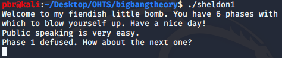

This is related to Reverse engineering process.

To get the files related this you can follow up this repository: [https://github.com/pbr94/bigbangtheory]

In that particular repository there are file called "Sheldon1". This walkthrough document totally related to that file. This file is an executable file. So we can run that particular file and see the results.

So we can see that relevant file is hiding something. Then we try to disassemble this file using ***gdb*** tool.

First of all we should have to find out any function is in this file. Let's try to do that. 

Then it will be given breakpoint on to the ***main function*** of this program. 

Great!! now we can disassemble that main function.

When we are going through this main function we can see there are six phases which are jumped using the code. Those phases can be another set of functions. So we are going to looked into that "Phase_1".

So we can disassemble this "Phase_1".

So we have to have go through this disassembled function. Then we can see something special on this code segment. There is pushed memory address to the stack.

>0x80497c0

 In 'Phase_1', There is a call to function 'strings_not_equal' with the first
argument is 'input', the second argument is constant memory address 0x80497c0.
after the call, in line 390, it's testing the return value, 'explode_bomb' is
called if non-zero. So, we just type the same string as stored at 0x80497c0

Here you go, you have got something interesting. Then we can check this string with "Sheldon1".

***Congradulation!!!*** You have passed your first phase. 
